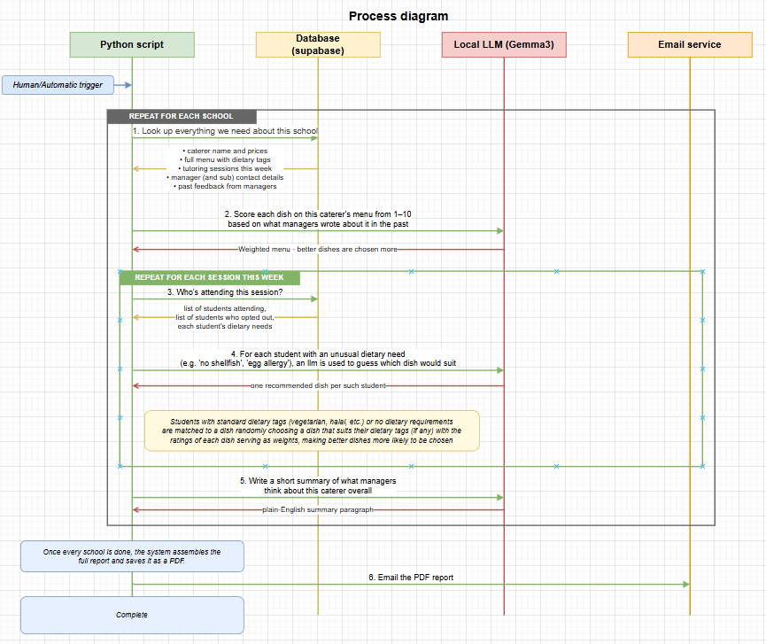
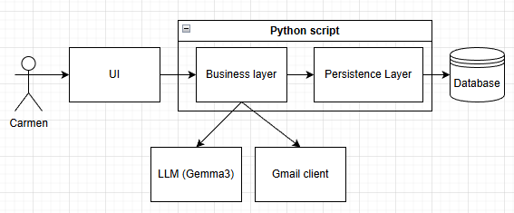
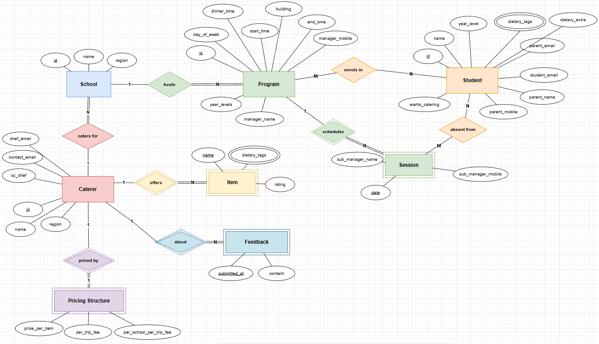
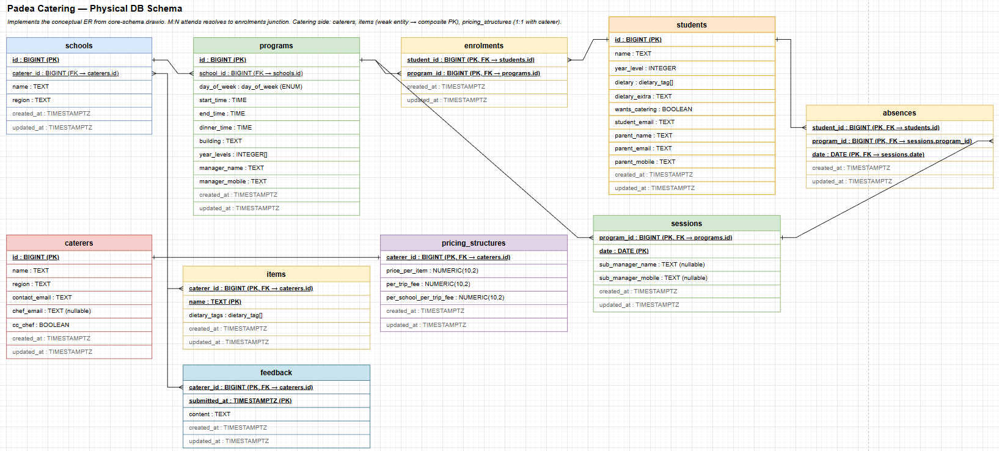

# Automated Catering Service
This document details at a high level the overall function of this automated catering service.
The overall functionality of this system is composed of the script, the database and a locally hosted LLM
using ollama.

This script when run, uses the data stored in the database to construct and email a completed
orders pdf to email provided in the main function. The script takes into account the enrolments in a specific session, absences on the given day, students who opted out of catering, dietary tags and extra dietary requirements and manager feedback. The cost is also estimated under the assumption that each session will ask the caterer to make one trip with only one stop being the session itself.

## System Architecture
The diagram below describes the intended system architecture. The idea is the system can be run by Carmen when required, drawing on all stored data. For this project, the UI layer has been disregarded as it is a relatively unimportant part of the system functionality wise and can be interchanged very easily.

## Database
The diagrams below describe the conceptual and tabular schema for the database. The MOQ data has been left off due to time constraints and AI-generated manager feedback has been used to fill in the feedback table.

## LLM usage
A locally hosted LLM (Gemma3) has been used. Given the strict and simple requirements given to the LLM, a lightweight model is appropriate for the job. The LLM has been used to ingest and understand manager feedback, understand special dietary requirements and rank dishes from caterers based on feedback.
